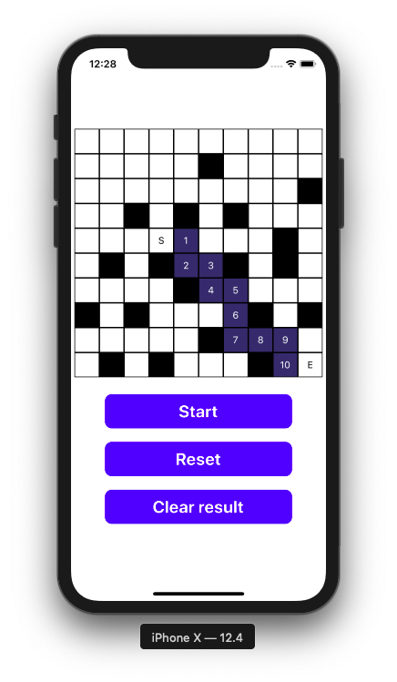
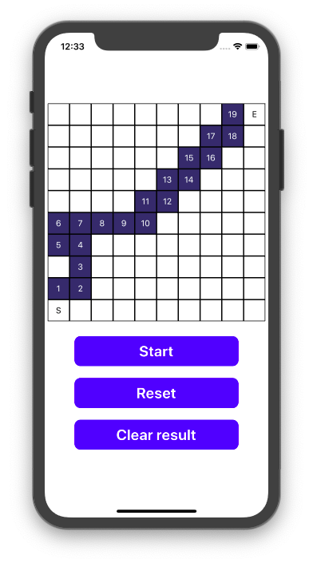

# React native fiding path algorithm
## Download
This project used expo, clone and then $ expo install  
Run on your device: open expo app and scan this QR code  
  
Or in this link: https://expo.io/@minhtamos/rn_bfs
## What it does?
Create a matrix with starting point and ending point and let the algorithm to find the path from start to end
## Algorithm used
BFS: Breadth-first search, prioritize the nearer one  
Just one, will have some more ^^
## How to use?
You will see 10x10 square buttons  
Click on them will change the status of the box  
(None (can go to) -> Blocked (can not go to) -> Starting point -> Ending point) respectively  
Click start to find the path from start to end  
Click reset to reset everything to none status  
Click clear result to set the path (the blue one) to none status  
## Some picture of it
Most of the time will work just fine  
  
But something will be like this  
  

